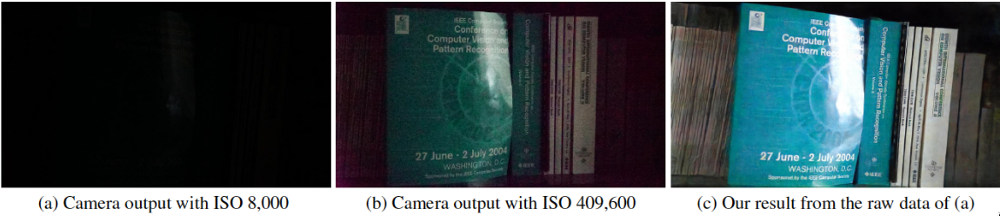
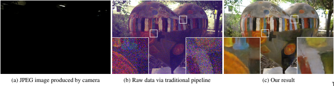
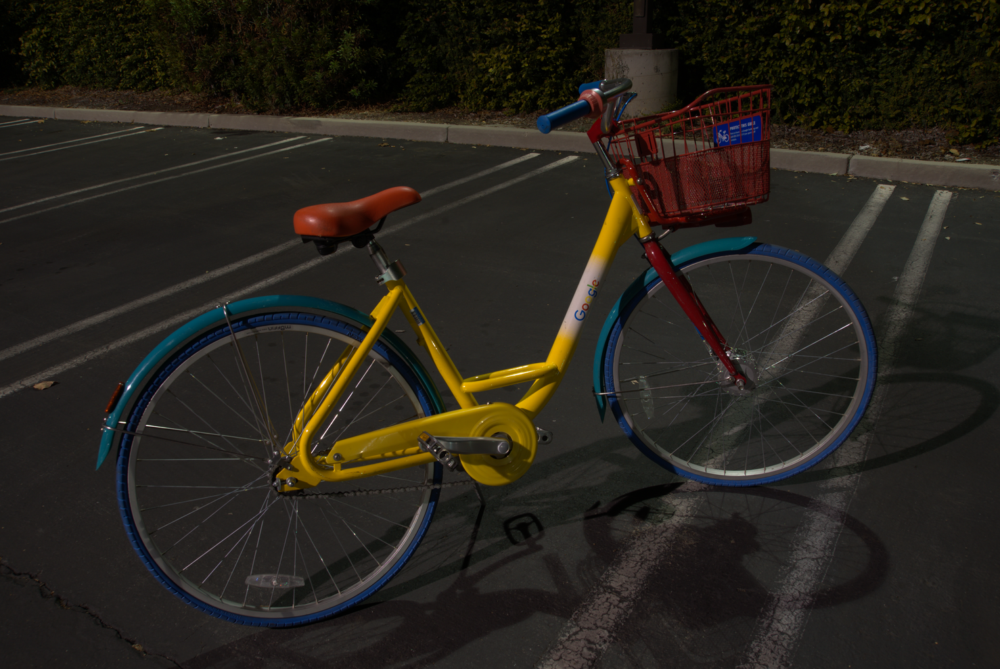
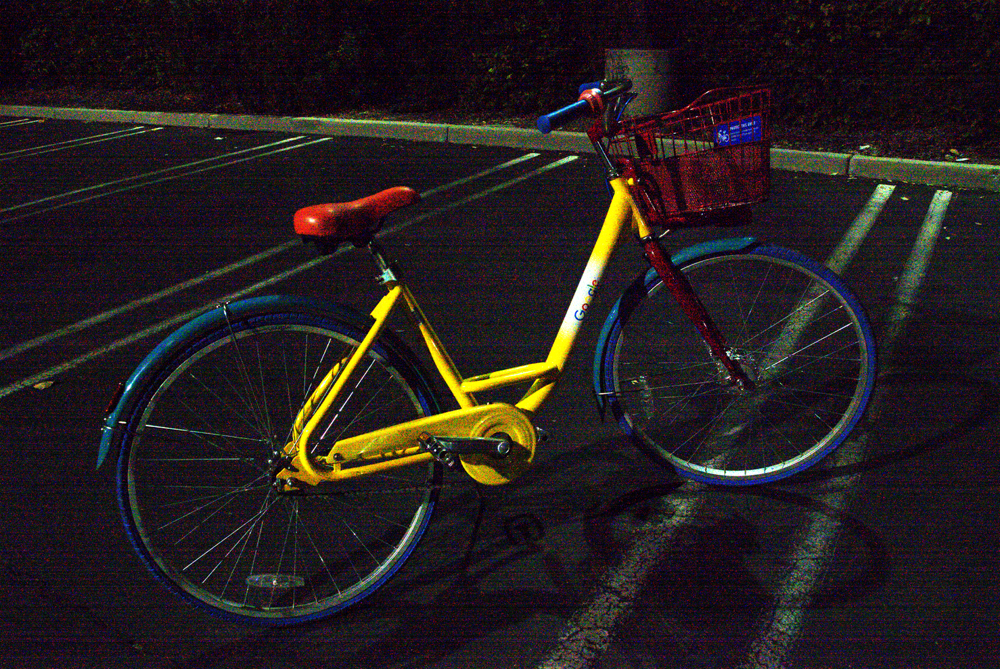
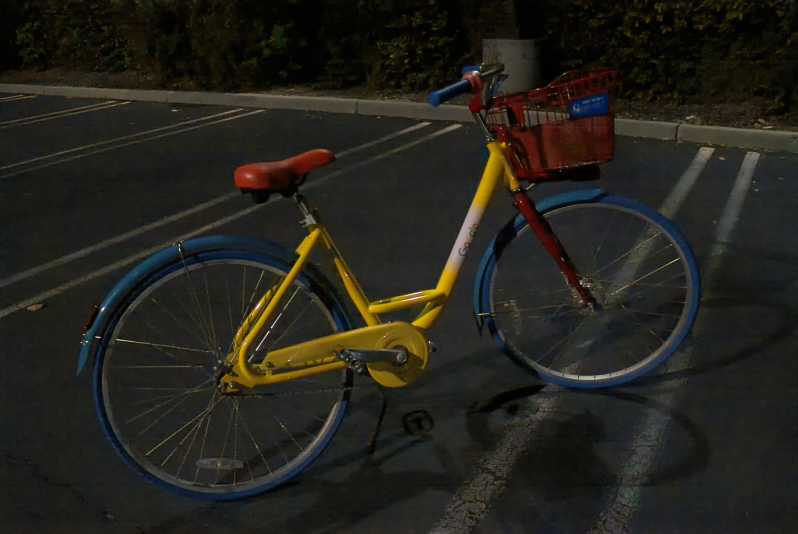
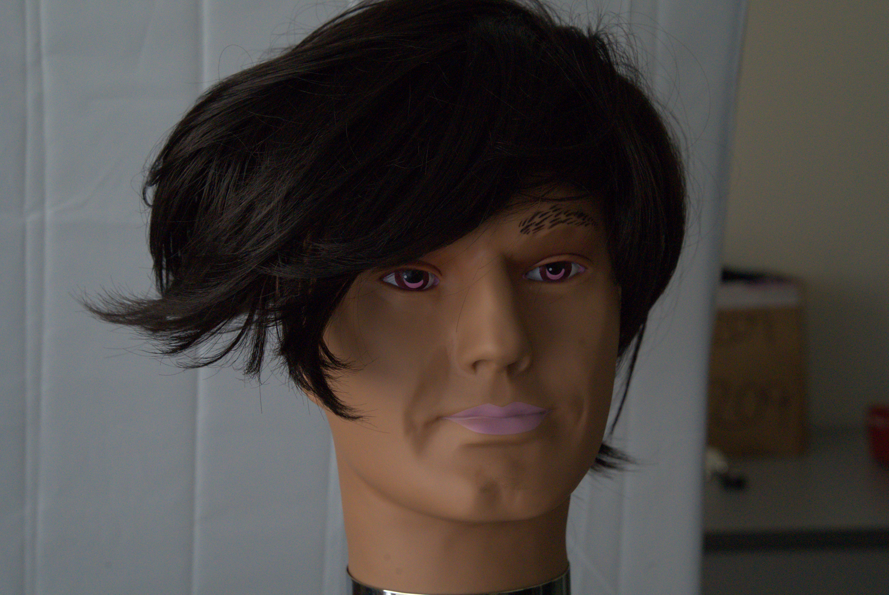
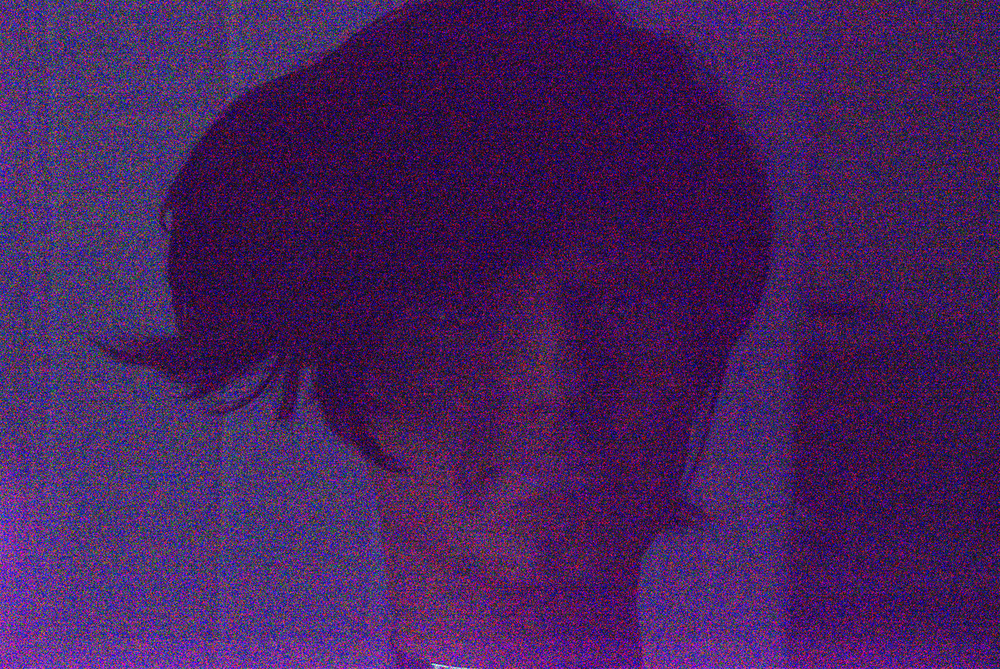
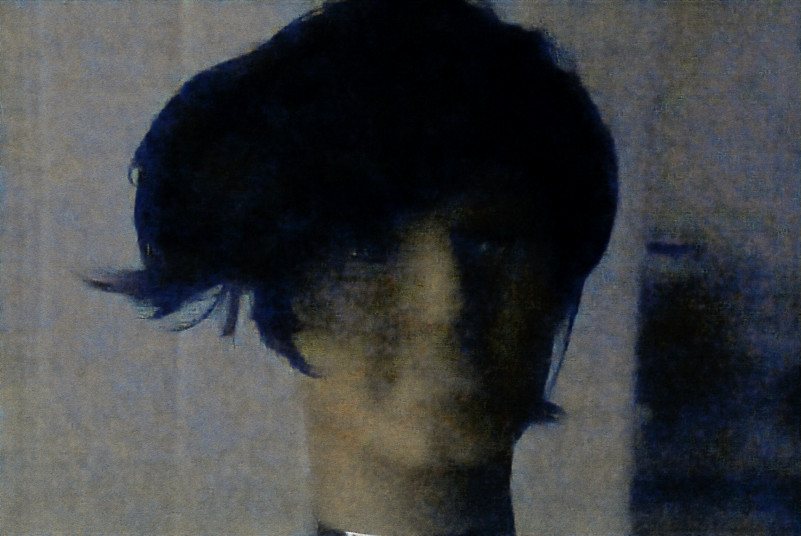

\pagebreak

# Paper Overview

## Goal and Approach

- High ISO is noisy

* Get long exposure quality with short exposures

- Train a model to reflect this

## Their Results

## Their Results

# Flaws of Current Implementation

## Python2

- Support ending soon

* Rife with deprecation warnings

- Can hurt adoption

## Provided Data/Models

- Unrealistic Hardware requirements to train

* Code is disjoint, tricky to get started

- Restricted to two Camera brands/RAW formats

# Demo

## Web App

- Increase exposure

* Encourage curiosity

# Our Results/Improvements

## Results

##

##

## Ground Truth

## Traditional Scaling

## Our Model

## Ground Truth

## Traditional Scaling

## Our Model

## Contributions

- Implement batching to reduce training memory usage

* Support DNG (Smartphone RAW)

- Created a Web App

* Basic CLI + module

- Refactored shared code

* Created a IPython Notebook for Colab

## Going Forward

- Supporting more raw formats

* General JPG/PNG implementation

- Visualize the model

* Optimize the amplification parameter

- Better hosting solution for dataset

* Put it in an App and charge \$5

# Thank you!

