# Abstract

The purpose of this project was to be able to take the research done
by Learning to See in the Dark and make it more accessible and
maintainable.
The work done was to port the code over to Python3, remove
deprecation warnings due to soon to be outdated code, and create a
better code base that is easily readable and therefor more
maintainable.

# Introduction

Low-light photography is difficult to get correct. As a photographer,
we have three settings on that we can alter when taking a picture.
In low-light, most cameras will automatically bump up the ISO or
sensitivity of the sensor, which results in horrible noise. The
only option for quality low-light images is a long exposure time.
However, these exposure times are impossible to handhold, requiring
a tripod to hold the camera still. The paper seeks to answer the
question:

> What if we could train a network to recreate the quality of a long
> exposure image with a short-exposure input?

# Related Work

The paper ``Learning to See in the Dark'' proposed a new way of
making low light level photography more visible.
Instead of using the traditional pipeline of white balancing, gamma
correction, and denoising, the researchers replaced it with a single
convolutional neural network trained to do all of the above with
better results.
The implementation trained various low light level images with
different exposure times and comparing it to a long exposure of the
same scene to calculate a loss for that round of training.
Other research has gone into denoising and low light enhancement as
stated in the paper. But, the provided model produces images with
much level noise and distortion than _all_ of these methods.

# Contributions

We were able to port over the Sony portion of the existing code to
Python3. Along with this, we also ported the code to Keras, as
the library used in original implementation is going out of service
soon.
This allows the code to last further into the future without the need
to change the code to keep up to date with newer package versions in
theory.

The original implementation required anywhere from 64 to 128 GB of
RAM to run the training set.
The research paper's implementation loaded all images into RAM
in order to lower the read times from disk as the files are
anywhere from 10 to 20+ MB each.
This is near impossible for most people to run as most machines
have anywhere from 8 to 16 GB of ram on average.
This change does slightly increase training times, but it can be run
with as little as 3GB of RAM.
In our case, it helped while training as we only had 12 GB of ram on
a Google Colaboratory virtual machine.
This allowed us to train and test the model, which ultimately enabled
us to develop a good enough understanding to port it Keras.

We have also created a web application to allow people with minimal
coding or machine learning experience to see what would happen if
they run the network on their own raw images.
The web application uses a Python3 flask back end for taking in the
POST requests and forwarding the images to the Keras neural network
for processing.
It will then send back a zipfile that contains all of the processed
images in png format.

We also verified the use of DNG's with the model.
At first, the model only had support verified support for Sony ARW
raw files.
From testing it, we were able to verify that DNG raw files work also.
Because of this, phones like the iPhone and Pixel (phones we had on
hand) are able to take raw images and input them into the application
and get back a corrected image.
This is very useful as phone cameras are notoriously bad at taking
images in the dark.
It has gotten better over the years, but from taking our own photos,
we were still seeing a large amount of noise from the images.

# Results

This is a _massive_ network, for not being a DNN. Thanks to Keras,
we were able to extract some information about the network.
Having ~30 layers and ~7.7 million trainable parameters, this is
a beast of a model. We also have a plot of what the model looks
like, with the input layer at the top. Here is that plot:

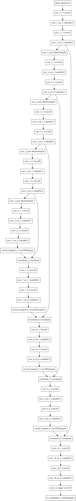

The following results are from the Keras model, trained for only
**11** epochs. The paper trained their model for 4001 epochs in
order to achieve their results. This is a testament to just how
powerful this model is. Given we had more time, we would have
liked to train a model for much longer.

It should be noted that the yellow tint present in the images
is due to the raw image library _RawPy_ doing inconsistent
white balancing. Given more time, we would like to resolve this
issue. We believe that this could have been a result of the Python
version upgrade, as the paper did not seem to run into these issues.

The left side is the input to the model, and the right side is the output.

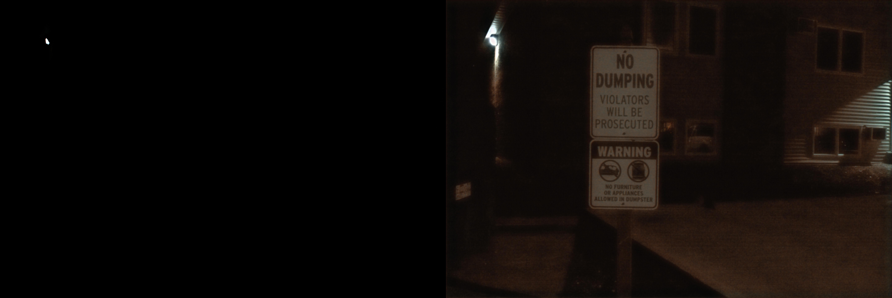

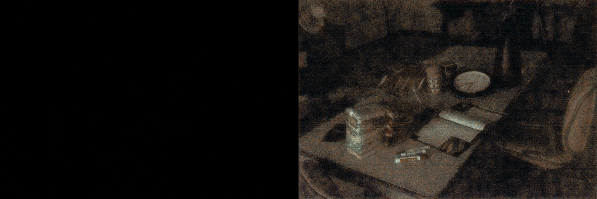

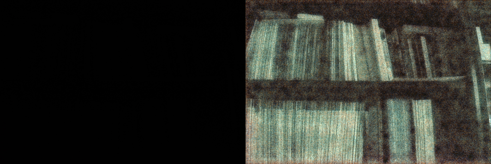

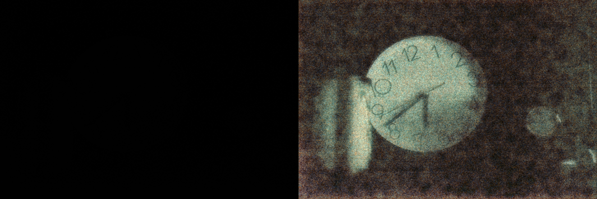

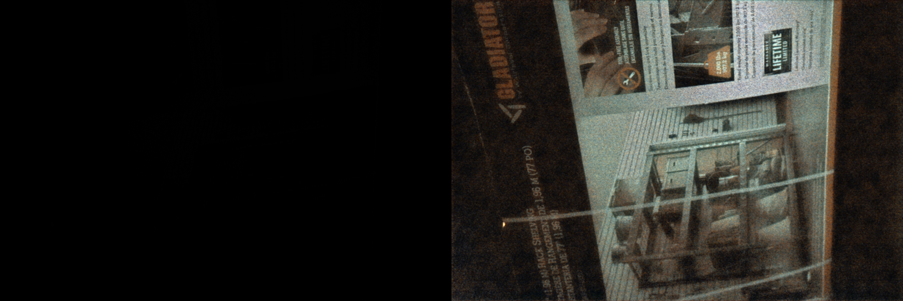

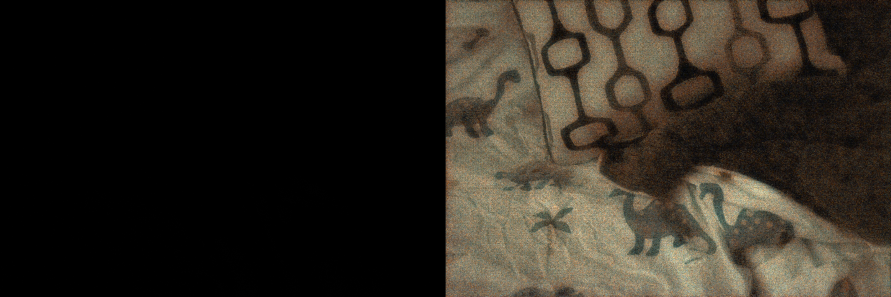

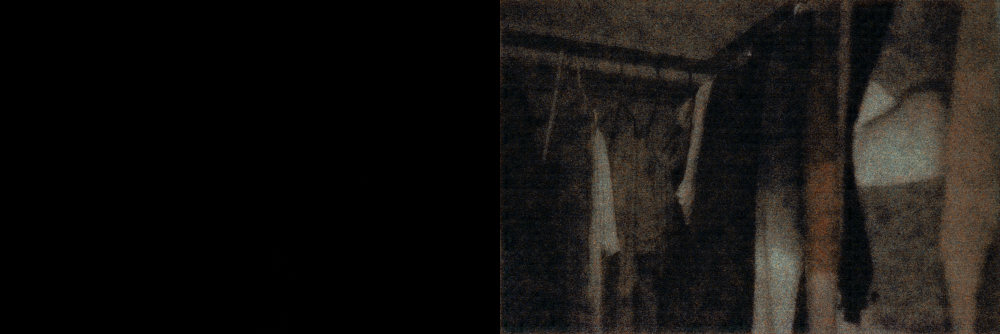

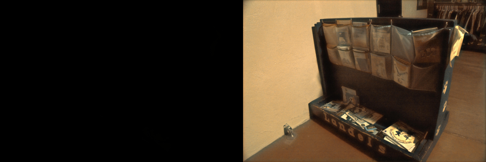

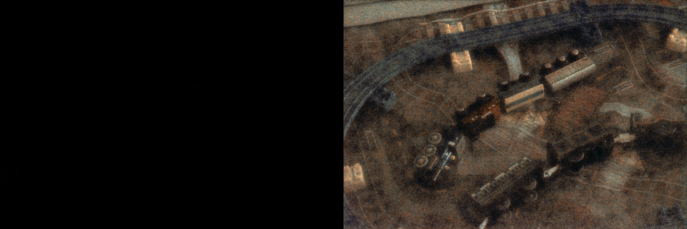

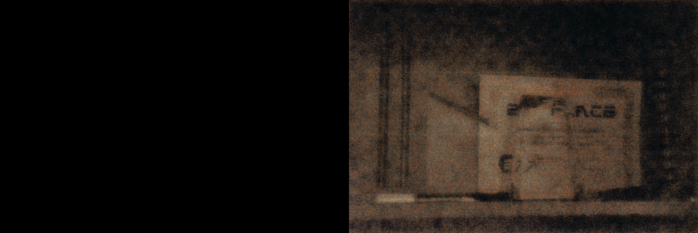

\pagebreak

## Files

Our repository can be found here:

> [https://github.com/jzlotek/cs583-final](https://github.com/jzlotek/cs583-final)

The repository is broken up into several directories.

- apps
	- the source for the front-end web application
		and a placeholder for a mobile-app
- docs
	- contains documentation for class
- notebooks
	- contains IPython notebooks for the improved paper implementation
	and the Keras implementation
- src
	- all of the python files for both the app's server and training the
	model
- correct_img.py
	- File to interface with a trained model

# Conclusion

All in all, we are very proud of the work we have done on this project.
We have learned about not only this model, but machine learning and its
application to computer vision.
